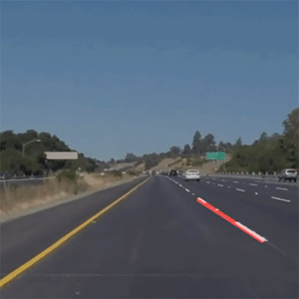

# Computer Vision for Lane Detection

Demo gif (no, i'm not the driver):



## What's about: 
Giving car camera frame this algorithm will identify the lane on the road.
Since a video is a series of frames together its also able to identify it in the video.


## How to run it:

1. Install requirements
```
pip install -r requirements.txt
```

2. On main.py just substitute the test_image link (for an image) and the cap link (for a video)

3. Execute only the part (image or video) you want to test, comment the other.

4. Run the file
```
python main.py
```

This code helps this type of applications (no, I'm not the passenger):


Any questions?

Just hit me up.

Francisco Varela Cid
