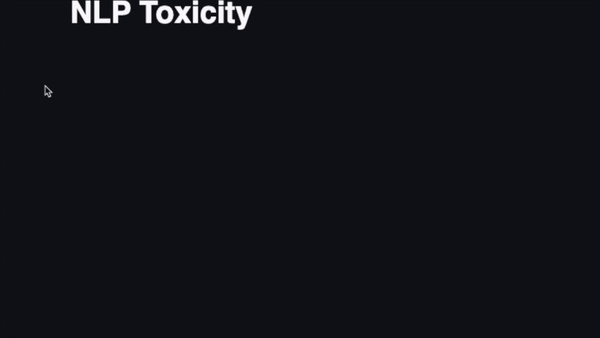

# NLP Toxicity Comment Prediction

This is just an example. I'm not toxic :)



What's about: 
Toxicity comments prediction.

The user rights a comment and the model will predict if it's toxic and which classify it.

The model is based on a pre trained Bert model.

## How to run it:

1. Install requirements
```
pip install -r requirements.txt
```

2. Run with Streamlit which will open a new tab in your browser
```
streamlit run main.py
```
3. Input a comment and check for it's toxicity


Any questions?

Just hit me up.

Francisco Varela Cid
Jan 2022