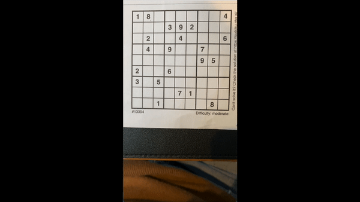

# Live Sudoku Solver

Sudoku solver example...



# 1/ Disclaimer:

- This project was build entirely by me for a final module project of Computer Vision at Epicode.
- The entire sudoku_solver.py was imported from another project since it was not the purpose of this project to build a Sudoku algorithm but instead applying AI skills to Computer Vision.

# 2/ How does it work?

- You will need: Python 3, OpenCV 4, Pytorch and Torchvision.
- main.py is the main running file.

# 3/ How can you run it?

- Download all the files 
- Run the script below on your environment (conda is what I use)
```
pip install -r requirements.txt
```
- You don't need to train CNN on your own. I have trained a CNN model and saved it as model.pt.
- For training your own CNN:
    - Download Chars74K Dataset (http://www.ee.surrey.ac.uk/CVSSP/demos/chars74k/)
    - Create images folder in the main project directory
    - Inside images folder create folder from "1" to "9" and copy the respective images
    - Run train.py
    - Note: if you want to test the model just uncomment lines and in - train_loader = DataLoader(dataset, batch_size=128, shuffle=True) - substitute the first input to train_dataset. Also uncomment everything from #Test the model below.
- Run main.py


January 2022

Created by Francisco Varela Cid