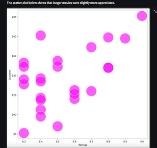

# IMDB Webscrapping Project



## What's about: 
Webscrapped the best adventure movies on IMDB.com with the goal to retreive some data analysis conclusions.

Data Analysis Goals:
- Rating vs Duration
- Rating vs Director
- Release Year vs Box Office
- Rating vs Release Year
- Rating vs Box Office

Many more analysis can be made with the data scrapped.

## How to run it:

1. 1) Install requirements by running:
```
pip install -r requirements.txt
```
2. Run with Streamlit which will open a new tab in your browser
```
streamlit run streamlit.py
```
3. Check the plots and conclusions.


Any questions?

Let me know!

Francisco Varela Cid